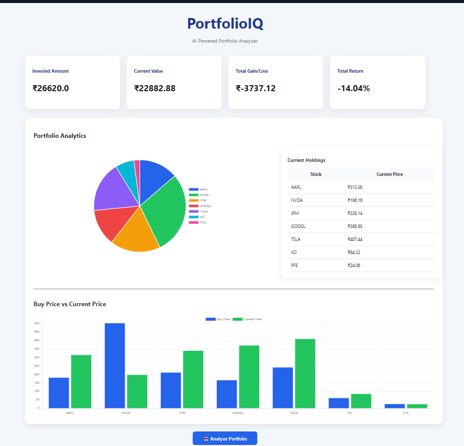
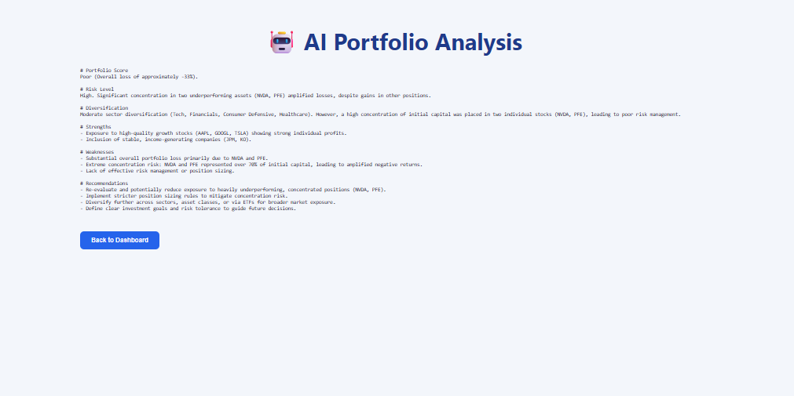


# 📈 PortfolioIQ – AI Powered Portfolio Analyzer

An AI-powered investment portfolio analysis platform built using **Python, Flask, SQLite, yFinance, Chart.js, and Google Gemini AI**.

PortfolioIQ allows users to build a stock portfolio, fetch live market prices, visualize portfolio allocation, and receive AI-generated investment insights on diversification, risk, and portfolio health.

---

## 🚀 Features

- 📊 Live portfolio valuation using Yahoo Finance
- 💰 Invested Amount, Current Value, Profit/Loss & Returns
- 📈 Portfolio Allocation Pie Chart
- 📉 Buy Price vs Current Price Bar Chart
- 🤖 AI-powered portfolio analysis using Google Gemini
- 🗑️ Add and Delete stocks (CRUD)
- 💾 SQLite database for portfolio storage
- 🎨 Responsive and clean UI

---

## 🖼️ Screenshots

### Dashboard



---

### AI Portfolio Analysis




---

## 🛠️ Tech Stack

### Backend
- Python
- Flask
- SQLite

### Finance
- yFinance

### AI
- Google Gemini API

### Frontend
- HTML
- CSS
- JavaScript
- Chart.js

---

## 📂 Project Structure

```
PortfolioIQ
│
├── app.py
├── requirements.txt
├── README.md
├── .gitignore
├── .env.example
│
├── static
│   ├── style.css
│   └── script.js
│
├── templates
│   ├── index.html
│   └── analysis.html
│
├── utils
│   ├── ai.py
│   ├── finance.py
│   └── database.py
│
└── screenshots
```

---

## ⚙️ Installation

Clone the repository

```bash
git clone https://github.com/vivek-314/Portfolio_AI_tracker.git
```

Go into the project folder

```bash
cd Portfolio_AI_tracker
```

Create a virtual environment

### Windows

```bash
python -m venv venv
venv\Scripts\activate
```

### Linux / macOS

```bash
python3 -m venv venv
source venv/bin/activate
```

Install dependencies

```bash
pip install -r requirements.txt
```

---

## 🔑 Environment Variables

Create a file named

```
.env
```

Add your Gemini API key

```env
GEMINI_API_KEY=YOUR_GEMINI_API_KEY
```

You can obtain a free API key from

https://aistudio.google.com/

---

## ▶️ Run the Application

```bash
python app.py
```

Open

```
http://127.0.0.1:5000
```

---

## 📊 Portfolio Analytics

The application calculates

- Invested Amount
- Current Portfolio Value
- Profit / Loss
- Overall Return %
- Individual Stock Performance

---

## 🤖 AI Portfolio Analysis

Using Google Gemini, PortfolioIQ provides

- Portfolio Score
- Risk Assessment
- Diversification Analysis
- Portfolio Strengths
- Weaknesses
- Personalized Investment Recommendations

---

## 🔒 Security

Sensitive files are excluded from Git using `.gitignore`.

Ignored files include

```
.env
venv/
database.db
__pycache__/
```

This ensures API keys and local databases are never uploaded to GitHub.

---

## 🚀 Future Improvements

- Edit existing holdings
- User authentication
- Multiple portfolios
- Historical performance tracking
- Sector allocation chart
- Export portfolio to CSV/PDF
- News sentiment analysis
- Risk metrics (Beta, Sharpe Ratio)

---

## 👨‍💻 Author

**Vivek Chaurasia**

GitHub:
https://github.com/vivek-314
